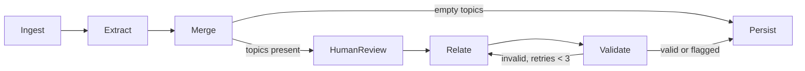
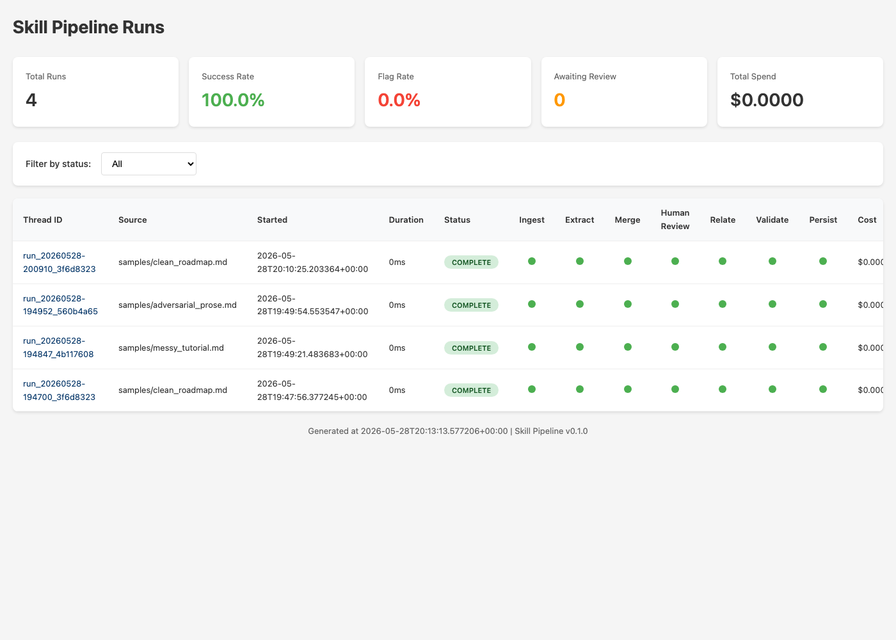
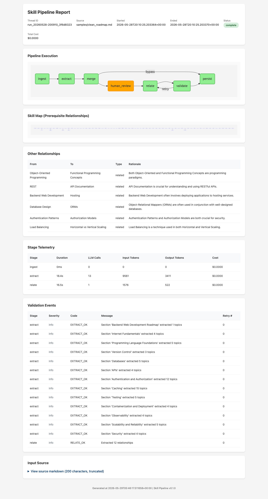
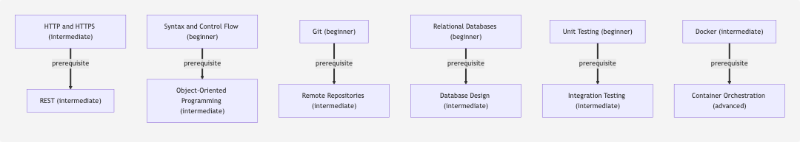

# Pripton Skill Pipeline

A small workflow system that takes a markdown learning document (a tutorial, a roadmap, a set of course notes) and produces a structured skill map — topics with metadata, plus typed relationships between them — using an LLM. Built for the Pripton AI Workflow Engineering assignment.

The submission has two parts:

- **Part 1 (this prototype):** the workflow code, the design notes in `DESIGN.md`, and the per-run reports in `runs/`.
- **Part 2 (research):** `RESEARCH.md`, a discussion of reliability challenges and the relevant tool landscape.

If you have 90 seconds, read `DESIGN.md` sections 1 and 2. If you have 5 minutes, also open one of the `runs/*/report.html` files.

---

## What this does



The pipeline reads a markdown file, splits it on headings, calls the LLM in parallel (bounded by a concurrency cap) to extract topics from each section, merges and deduplicates, optionally pauses for human review, asks the LLM to identify prerequisite/related/subtopic relationships between topics, validates the relationships against schema and business rules (no cycles, no dangling references, no self-loops), retries with feedback when validation fails, and persists the final skill map as JSON plus a self-contained HTML report. The document body is passed to the model as delimited, untrusted data (a basic prompt-injection mitigation).

The orchestration is built with **LangGraph** for durable state and conditional flow. Structured LLM output is enforced via **tool-use / function-calling** (Groq's OpenAI-compatible API surface, against `llama-3.3-70b-versatile`) and validated by **Pydantic**. Cycle detection uses **networkx**. The HTML report and the runs-index page use **Jinja2** templates. (The project was originally built against Anthropic and migrated to Groq mid-build — see DESIGN.md Section 8.)

---

## Screenshots

**Runs index** — the operator dashboard, regenerated after every run. Per-stage status, retry counts, and cost at a glance (the "monitor workflows at scale" view).



**Per-run report** — a self-contained HTML report per run: the pipeline diagram (with the human-review interrupt highlighted in orange), token telemetry, validation events, and the skill-map graph.



**Skill map** — extracted topics with difficulty, connected by prerequisite edges (shown here for the `adversarial_prose` sample).



---

## Install

Requires Python 3.11+.

```
git clone <this-repo>
cd pripton-skill-pipeline
pip install -e ".[dev]"
cp .env.example .env
# Edit .env and set GROQ_API_KEY
```

The tests do not need an API key (the LLM client is mocked at the boundary):

```
pytest
```

---

## Quick start

Three sample inputs are in `samples/`:

- `clean_roadmap.md` — structured backend dev roadmap, exercises the happy path
- `messy_tutorial.md` — narrative React Hooks tutorial, exercises retry-with-feedback
- `adversarial_prose.md` — engineering essay with no structure, exercises flag-don't-fail

Run one:

```
python -m skillpipeline run samples/clean_roadmap.md
```

You'll see Rich-formatted progress in the terminal. The run produces a directory under `runs/`:

```
runs/run_20260527-143022_a1b2c3/
├── skill_map.json       # The final structured output
├── skill_map.mmd        # Mermaid source for offline graph rendering
├── run_log.json         # Full execution log + telemetry
└── report.html          # Self-contained HTML report — open this
```

A top-level `runs/index.html` is regenerated after every run. Open it for an Airflow-grid-style view of all past runs with per-stage status, retry counts, and cost.

---

## Human-in-the-loop

The pipeline pauses for human review only when it shows signs of uncertainty (any section needed at least one retry) or when you opt in with `--always-review`:

```
python -m skillpipeline run samples/messy_tutorial.md --always-review
```

When it pauses, you'll see something like:

```
Pipeline paused for human review.
Thread: run_20260527-143022_a1b2c3
Edit:   runs/run_20260527-143022_a1b2c3/topics_for_review.json
Resume: python -m skillpipeline resume run_20260527-143022_a1b2c3
```

Edit the JSON file (remove, add, or modify topics), then resume:

```
python -m skillpipeline resume run_20260527-143022_a1b2c3
```

The graph state was persisted to `runs/{thread_id}/state.sqlite` via LangGraph's `SqliteSaver`, so the resume picks up exactly where the interrupt happened, with your edits as the new approved topic set.

---

## Other commands

```
python -m skillpipeline review <thread_id>      # Open topics_for_review.json in $EDITOR
python -m skillpipeline stats                    # Aggregate stats across all runs
python -m skillpipeline stats --json             # Same, as JSON
python -m skillpipeline cache list               # List cached source_id hashes
python -m skillpipeline cache clear              # Clear the content-hash cache
```

---

## Idempotency

The system computes a SHA-256 hash of the input bytes and caches the output at `.cache/{hash}.json`. Re-running the same input is a cache hit — no LLM calls, no cost, deterministic answer. Cache is bypassed with `--no-cache` and is not populated for flagged runs.

This is content-addressed caching, which is what makes the pipeline strictly idempotent: two callers sending the same input content always get the same output, regardless of when or where.

---

## Project structure

```
pripton-skill-pipeline/
├── README.md              # This file
├── DESIGN.md              # Submission design notes
├── RESEARCH.md            # Part 2 deliverable
├── PLAN.md                # Implementation spec (kept for transparency)
├── pyproject.toml
├── src/skillpipeline/     # All source code
├── samples/               # Three test inputs
├── tests/                 # Tests (pass without API key)
├── runs/                  # Generated per-run output + index.html
└── .cache/                # Content-hash cache
```

The source layout, with one Python file per stage, mirrors the workflow diagram. Pydantic models live in `src/skillpipeline/models.py`; the LangGraph definition is in `src/skillpipeline/graph.py`; prompts are plain text in `src/skillpipeline/prompts/`.

---

## Tests and CI

```
pytest -v                # All tests, no API key needed
ruff check .             # Lint
mypy src                 # Type check (local only — not gated in CI; see ci.yml)
```

GitHub Actions runs lint + tests on every push and pull request. mypy runs locally during development but is not gated in CI due to pre-existing type debt (documented in DESIGN.md Section 8).

---

## Where to look for what

- **What does the system do, in plain English?** `DESIGN.md` section 1.
- **What's the architecture and why?** `DESIGN.md` sections 2–3.
- **How does validation and retry work?** `DESIGN.md` section 4.
- **How is idempotency handled?** `DESIGN.md` section 5.
- **What was observed on the three test inputs?** `DESIGN.md` section 8 + the per-run reports in `runs/`.
- **What about the broader landscape of reliable AI workflows?** `RESEARCH.md`.
- **Glossary of terms.** End of `DESIGN.md`.
- **Implementation-level spec used to build this.** `PLAN.md`.
